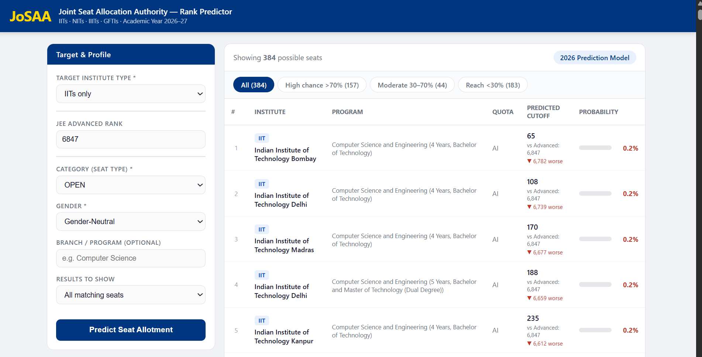
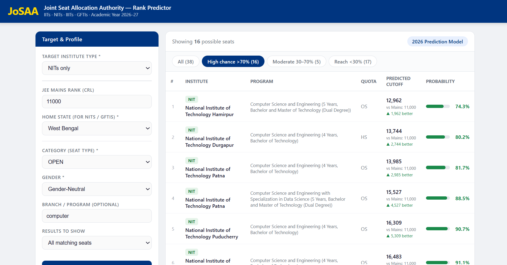
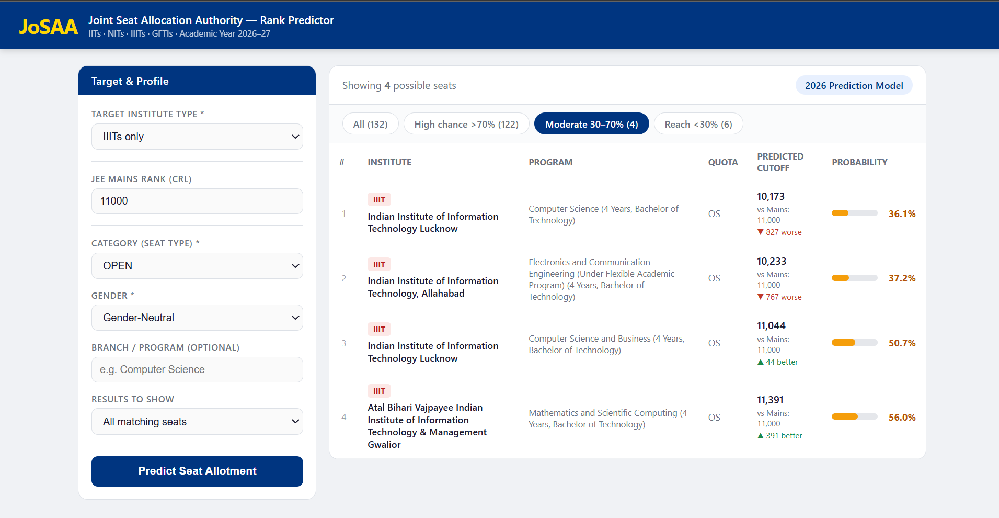
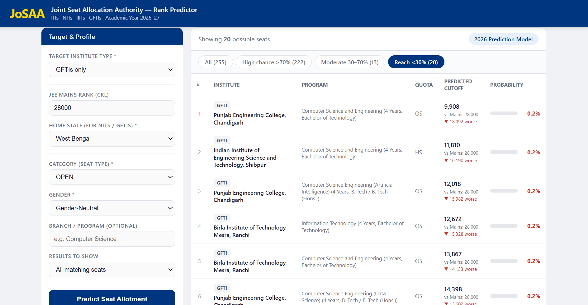

# JoSAA College Predictor 2026

A web app that predicts your chances of getting into IITs, NITs, IIITs, and GFTIs during JoSAA counselling, based on your JEE Main / JEE Advanced rank. It analyzes historical opening/closing rank data, projects next year's cutoffs using a **linear regression model built from scratch with NumPy** (no scikit-learn), and shows you a ranked, filterable list of seats with an admission probability for each.

**Live Demo:** [https://jee-rank-predictor-twit.onrender.com/](https://jee-rank-predictor-twit.onrender.com/)

---

## Screenshots

**IIT prediction (JEE Advanced rank)**


**NIT prediction — High chance seats**


**IIIT prediction — Moderate chance seats**


**GFTI prediction — Reach seats**


---

## Features

- **Covers all 4 institute categories** — IITs, NITs, IIITs, and GFTIs (Government-Funded Technical Institutes) — each with its own rank type (Mains vs Advanced) and quota rules.
- **Home-state aware** — correctly applies Home State (HS) vs Other State (OS) quota logic for NITs and GFTIs, using a keyword-based mapping of institute name → state.
- **Per-seat cutoff prediction** — every unique combination of institute + program + quota + category + gender is treated as its own "seat," with its own multi-year history and its own regression.
- **Admission probability, not just a predicted rank** — converts the gap between your rank and the predicted cutoff into a 0–100% probability using a sigmoid function, so seats are easy to compare at a glance.
- **Confidence labeling** — flags each prediction as `low` / `medium` / `high` confidence depending on how many years of data exist and how volatile the seat's cutoff history is.
- **Filters** — filter by institute type, branch/program keyword, category (OPEN/OBC-NCL/SC/ST/EWS, incl. PwD), gender pool, and result count; quick-tabs to jump to High chance (>70%), Moderate (30–70%), or Reach (<30%) seats.
- **No page reloads** — a single-page frontend that talks to the backend purely over a JSON API (`fetch`), so results render instantly after clicking "Predict."
- **Zero external ML dependencies** — the regression model (Normal Equation) is implemented directly with NumPy, not imported from scikit-learn, so the whole prediction pipeline is transparent and auditable.

---

## Concepts Used

| Concept | Where it's used |
|---|---|
| **Linear Regression (Normal Equation)** | Predicting each seat's 2026 closing rank from its year-wise historical closing ranks |
| **Feature normalization (standardization)** | Years are centered and scaled before regression, for numerical stability |
| **Logistic (sigmoid) function** | Converting a predicted-cutoff-vs-your-rank gap into a 0–100% probability |
| **Data cleaning with pandas** | Whitespace normalization, dropping invalid rows, quota renaming/merging |
| **GroupBy aggregation** | Grouping historical rows into per-seat time series (`groupby('Seat_Key')`), and finding each year's last counselling round (`groupby('Year')['Round'].transform('max')`) |
| **REST API design** | A single `POST /api/predict` JSON endpoint decoupling frontend from backend |
| **CORS** | Allowing the frontend (served from the same Flask app, but architecturally a separate client) to call the API |

---

## The Theory: Linear Regression via the Normal Equation

For every seat with more than 3 years of history, the app fits a straight line through `(year, closing_rank)` points and extrapolates to 2026. Instead of using gradient descent, it solves for the optimal parameters **analytically** — the same derivation as in Andrew Ng's CS229 notes.

### 1. Setup

For $m$ training examples (years of data) and $n$ features (here $n=1$: the year), define:

- $x^{(i)} \in \mathbb{R}^{n}$ — the feature vector for example $i$ (i.e., that year)
- $y^{(i)} \in \mathbb{R}$ — the actual closing rank in that year
- $h_\theta(x) = \theta_0 + \theta_1 x_1 + \dots + \theta_n x_n = \theta^T x$ — the model's prediction, where $x_0 = 1$ is a constant "bias" feature prepended to every example so the line doesn't have to pass through the origin

Stack all $m$ examples into a **design matrix** $X \in \mathbb{R}^{m \times (n+1)}$ (one row per year, one column per feature, plus the bias column of 1s), and all targets into $y \in \mathbb{R}^{m}$.

### 2. Cost function

We want the $\theta$ that minimizes the sum of squared errors between predictions and actual closing ranks:

$$
J(\theta) = \frac{1}{2}\sum_{i=1}^{m}\left(h_\theta(x^{(i)}) - y^{(i)}\right)^2 = \frac{1}{2}(X\theta - y)^T(X\theta - y)
$$

### 3. Expand the cost function

$$
J(\theta) = \frac{1}{2}\left(\theta^T X^T X \theta - \theta^T X^T y - y^T X \theta + y^T y\right)
$$

Since $\theta^T X^T y$ and $y^T X \theta$ are both scalars and transposes of each other (so they're equal), this simplifies to:

$$
J(\theta) = \frac{1}{2}\left(\theta^T X^T X \theta - 2\theta^T X^T y + y^T y\right)
$$

### 4. Take the gradient with respect to θ and set it to zero

Using the matrix calculus identities $\nabla_\theta(\theta^T A \theta) = 2A\theta$ (for symmetric $A$) and $\nabla_\theta(\theta^T b) = b$:

$$
\nabla_\theta J(\theta) = X^T X \theta - X^T y
$$

At the minimum, the gradient is zero:

$$
X^T X \theta - X^T y = 0
$$

### 5. Solve for θ — the Normal Equation

$$
X^T X \theta = X^T y
$$

$$
\boxed{\theta = (X^T X)^{-1} X^T y}
$$

This gives the **exact, closed-form optimal parameters** in one shot — no iteration, no learning rate to tune.

### 6. Why the pseudoinverse instead of a plain inverse?

$X$ itself (shape $m \times (n+1)$) usually isn't square, so it has no inverse. But $X^TX$ *is* square ($(n+1)\times(n+1)$), which is exactly why the derivation multiplies through by $X^T$ first. Even so, $X^TX$ can be singular or poorly conditioned (e.g. very few years of data, or a repeated year). The implementation uses `np.linalg.pinv` (the Moore–Penrose **pseudoinverse**, computed via SVD) instead of `np.linalg.inv`, so it never crashes and always returns the best least-squares solution, even in degenerate cases.

### 7. How this maps to the code (`src/app.py` / `src/linear_regression.py`)

```python
class LinearRegression:
    def fit(self, X, y):
        X_b = np.hstack([np.ones((len(X), 1)), X])          # prepend x0 = 1 (bias column)
        self.theta = np.linalg.pinv(X_b.T @ X_b) @ X_b.T @ y # θ = (XᵀX)⁻¹Xᵀy
        return self

    def predict(self, X):
        X_b = np.hstack([np.ones((len(X), 1)), X])
        return X_b @ self.theta                              # h(x) = Xθ
```

Before fitting, the year values are **standardized** (`(X - mean) / std`) so the regression isn't numerically unstable from working with large raw year numbers like 2024, 2025, etc.

### 8. From predicted rank to probability

Once the predicted 2026 closing rank is known, the app computes:

$$
\text{gap} = \frac{\text{predicted\_closing} - \text{your\_rank}}{\text{predicted\_closing}}
$$

and passes it through a **sigmoid**:

$$
P(\text{admission}) = \frac{1}{1 + e^{-k \cdot \text{gap}}}, \quad k = 7
$$

A large positive gap (your rank is much better/lower than the predicted cutoff) pushes probability toward 100%; a large negative gap pushes it toward 0%. The constant $k=7$ controls how sharply probability rises around the cutoff boundary.

---

## Tech Stack

**Backend**
- [Flask](https://flask.palletsprojects.com/) — lightweight Python web framework, serves both the REST API and the static frontend
- [Flask-CORS](https://flask-cors.readthedocs.io/) — enables cross-origin requests from the frontend
- [NumPy](https://numpy.org/) — matrix algebra for the from-scratch linear regression
- [pandas](https://pandas.pydata.org/) — loading, cleaning, and grouping the historical JoSAA dataset
- [Gunicorn](https://gunicorn.org/) — production WSGI server for deployment

**Frontend**
- Plain HTML, CSS, and vanilla JavaScript (`fetch` API) — no framework, no build step

---

## Project Structure

```
Clg Predictor/
├── data/
│   └── josaa_data.csv          # Historical JoSAA opening/closing rank data
├── frontend/
│   └── index.html              # Single-page UI (form + results table)
├── notebooks/
│   ├── 01_exploration.ipynb    # Exploratory data analysis
│   ├── 02_model_building.ipynb # Regression model prototyping
│   └── 03_prediction.ipynb     # Prediction sanity checks
├── src/
│   ├── app.py                  # Flask server + prediction pipeline (main entry point)
│   ├── linear_regression.py    # Standalone from-scratch LinearRegression class
│   ├── logistic_regression.py  # (utility / experimentation)
│   ├── diagnose_data.py        # Data-quality diagnostics script
│   └── requirements.txt        # Python dependencies
└── README.md
```

---

## Getting Started (Run Locally)

### Prerequisites
- Python 3.9+
- `pip`

### 1. Clone the repository
```bash
git clone https://github.com/<your-username>/<your-repo-name>.git
cd "Clg Predictor"
```

### 2. Install dependencies
```bash
pip install -r src/requirements.txt
```

### 3. Run the server
```bash
python src/app.py
```

### 4. Open the app
Visit **http://localhost:5000** in your browser. Flask serves the frontend directly, so there's nothing else to start — one server, one command.

---

## How to Use

1. **Select target institute type** — IITs, NITs, IIITs, or GFTIs. The form fields adapt automatically:
   - IITs → asks for **JEE Advanced rank**
   - NITs / IIITs / GFTIs → asks for **JEE Mains (CRL) rank**
   - NITs / GFTIs also require your **Home State**, since seat quotas differ for home-state vs other-state candidates
2. **Enter your rank(s).** You can fill in Mains, Advanced, or both if you're unsure which institute type to target.
3. **Choose your Category** (OPEN, OBC-NCL, SC, ST, EWS, or their PwD variants) and **Gender pool**.
4. *(Optional)* Type a **branch/program keyword** (e.g. "Computer Science") to narrow results to a specific field.
5. *(Optional)* Choose how many results to display — Top 20 / 50 / 100 / All.
6. Click **Predict Seat Allotment**.
7. Browse the results table, sorted by best (lowest) predicted cutoff first. Use the **All / High chance / Moderate / Reach** tabs to filter by admission probability:
   - **High chance (>70%)** — your rank is comfortably better than the predicted cutoff
   - **Moderate (30-70%)** — a genuine toss-up
   - **Reach (<30%)** — unlikely, but not impossible

Each row shows the institute, program, quota, predicted 2026 closing rank, how it compares to your rank, and the probability bar.

---

## How Prediction Works, End-to-End

1. On server startup, `app.py` loads `data/josaa_data.csv` into a pandas DataFrame and cleans it: normalizes whitespace, drops Architecture/Planning programs (Paper 2 seats), removes certain quota codes, and merges the `AI` quota into `OS` for non-IIT institutes so quota labels are consistent.
2. Only each year's **final counselling round** is kept, since ranks stabilize by the last round.
3. Rows are grouped into unique **"seats"** (institute + program + quota + category + gender).
4. When you submit the form, the frontend `POST`s your inputs as JSON to `/api/predict`.
5. The backend filters seats matching your category/gender, applies IIT/NIT/IIIT/GFTI-specific quota and home-state routing rules, and for each matching seat:
   - Fits (or averages, if there's too little data) a regression on that seat's historical closing ranks
   - Projects the 2026 closing rank
   - Computes an admission probability via the sigmoid function described above
6. Results are sorted by predicted closing rank and returned as JSON, which the frontend renders into the results table — no page reload.

---

## Disclaimer

This tool provides **statistical estimates based on historical JoSAA data**, not official predictions. Actual JoSAA cutoffs depend on many factors (number of applicants, seat matrix changes, new programs, policy changes) that a historical trend line cannot fully capture. Always cross-check with official JoSAA sources before making admission decisions.

---

## License

This project is open source. Add your preferred license (e.g. MIT) here.

---

## Contributing

Issues and pull requests are welcome — whether it's improving the prediction model, adding more institute categories, or refining the UI.
